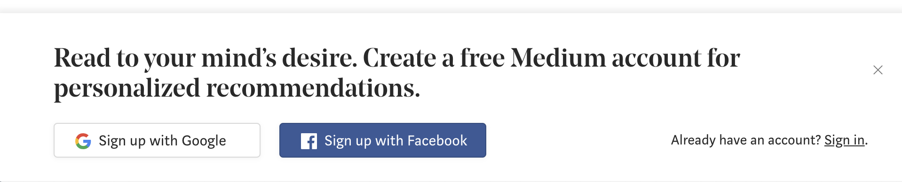

#CloseMe

**CloseMe** is a simple open-source Chrome extension that will auto-close all the invasive pop-ups from the [Medium](https://medium.com) website.

Recognize this

 or this?

Annoying, isn't it ? They are slowly getting better, but are way too invasive. . . 

## Usage

Simply install the extension and enjoy

## Phoning home

In an attempt to make a compelling case for how annoying those pop-ups are, I am collecting how many pop-ups have been closed over time. 
Nothing else. It is totally anonymous, and nothing else than an increment to a counter :).

## Author

[Julien Lengrand-Lambert](https://github.com/jlengrand)

## Contributing

Ideas and Merge Requests are more than welcome!

## LICENSE

See LICENSE for full text, but the license is [Creative Commons Attribution NonCommercial ShareAlike (CC-NC-SA)](https://tldrlegal.com/license/creative-commons-attribution-noncommercial-sharealike-(cc-nc-sa)).

## Resources

* [Icon](https://www.flaticon.com/free-icon/cancel_128397#term=sign&page=1&position=59)
